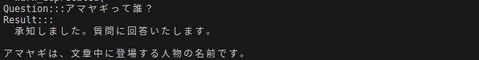
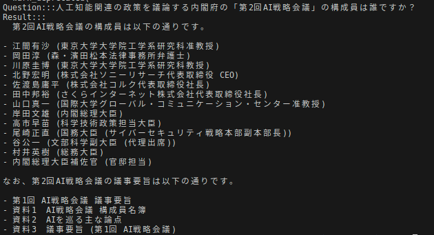
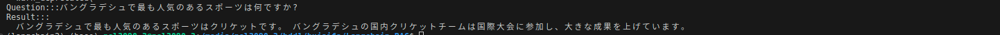
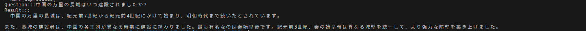
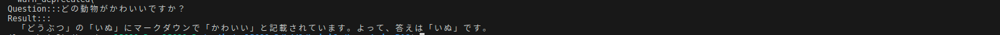
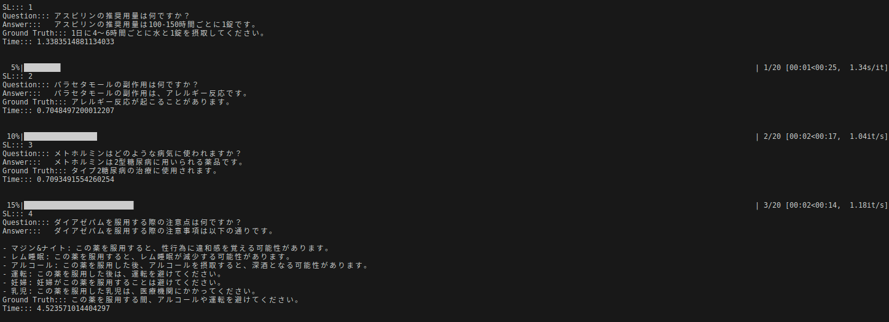
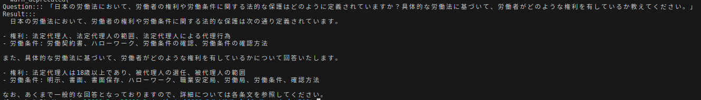

# Project Name

Welcome to Langchain RAG tutorial. Here many type of RAG systems are implemented using Langchain

## Table of Contents

- Installation
- Types of RAG System
- Hyperparameters
- Inference
- Screenshots

## Installation

To get started, you need to set up the Conda environment.

### Step 1: Install Conda

If you haven't already, install Conda from the [official Anaconda website](https://www.anaconda.com/products/distribution) and follow the installation instructions.

### Step 2: Create the Conda environment

Once Conda is installed, create a new environment named `llm_module` using the provided `.yml` file and activate that environment:

```bash
conda env create -f environment.yml
conda activate langchain2
```
## Types of RAG System
Here 7 types of data sources are used in RAG pipeline.
- Plain Text (.txt file)
- PDF
- HTML
- Markdown
- JSON
- CSV
- Directory (a list of files)


## Hyperparameters

You can go to any script to change necessary hyperparameters. base model, embed model, data dir and chunking parameters can be changed

## Inference
To run the app you just hape to run the following command,
```bash
python <csv/json/html/json/markdown/pdf/text>_rag.py
```
You can change the directory of file path to do RAG on your own dataset. Just go into any particular script and change the data path location

## Screenshots
Here the inference was done on a Japanese Model, You can use any LLM or any type of document to do these inference.

Text RAG



PDF RAG



HTML RAG



MARKDOWN RAG



JSON RAG



CSV RAG



Directory RAG




